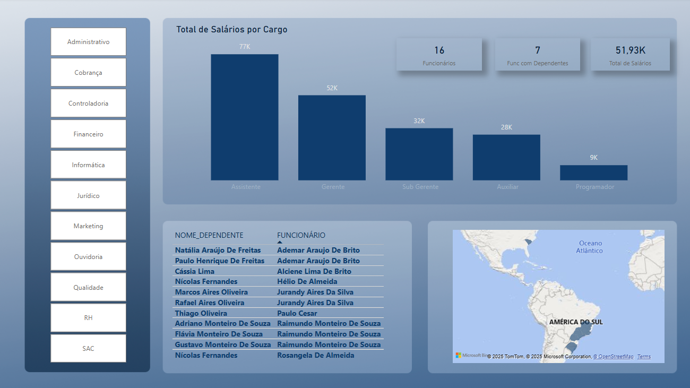
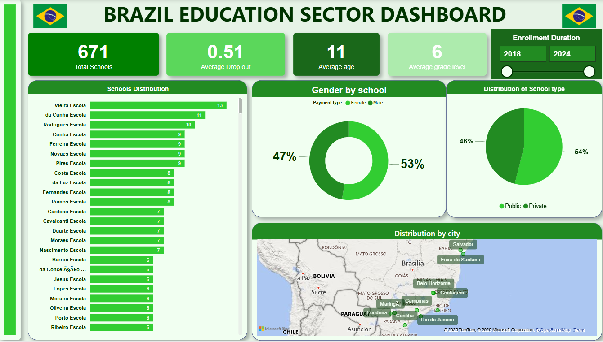

# Data Analytics Portfolio – Gabriela M.

Welcome! I'm a data analyst with a knack for transforming raw data into actionable insights. This portfolio showcases projects using R, Python, SQL, and Power BI to support business decisions and tell clear data stories.

---

## Projects Overview

### Bellabeat Case Study (R, Kaggle)  
**Goal:** Analyze smart device user behavior to uncover activity and sleep trends.  
**Tools:** R (`dplyr`, `ggplot2`), Kaggle Notebooks  
**Key Insights:**  
- Most users sleep 6–7 hours per night  
- Strong correlation between steps and calories burned  
- Suggestion: Introduce weekday activity reminders  
**Notebook:** [View on Kaggle](https://www.kaggle.com/code/gabriielaml/bellabeat-case-study-user-activity-insights)

---

### Online Retail Analytics (Python, Kaggle)  
**Goal:** Analyze retail transaction data to identify trends, returns, and customer segmentation.  
**Tools:** Python (`pandas`, `matplotlib`, `seaborn`)  
**Key Insights:**  
- Seasonal patterns in purchasing behavior  
- High return rates in certain categories  
- UK dominates sales volume  
**Notebook:** [View on Kaggle](https://www.kaggle.com/code/gabriielaml/online-retail-analytics)

---

### Superstore Sales Analysis (SQL, Python)  
**Goal:** Evaluate regional sales and shipping patterns.  
**Tools:** SQL (`ipython-sql`), Python (`pandas`, `plotly`)  
**Key Insights:**  
- West leads in volume, but lower margins  
- Standard Class shipping dominates  
- Technology is the most profitable category  
**Notebook:** [View on Kaggle](https://www.kaggle.com/code/gabriielaml/superstore-sql-sales-analysis-portfolio-project)

---

### Hospital Discharge Analysis (SQL, Python)  
**Goal:** Analyze patient discharge and payer type trends.  
**Tools:** SQL, Python  
**Key Insights:**  
- Discharge volume varies by hospital  
- Publicly insured patients stay longer  
- Some hospitals specialize in specific categories  
**Notebook:** [View on Kaggle](https://www.kaggle.com/code/gabriielaml/sql-data-analysis-patient-discharges-and-hospital)

---

### Tesla Financial Analysis (Python)  
**Goal:** Evaluate Tesla stock performance and estimate intrinsic value using DCF.  
**Tools:** Python (`pandas`, `matplotlib`, `numpy`)  
**Key Insights:**  
- Stock volatility and returns over time  
- DCF model estimates 5-year value of $57.2B  
- Included sensitivity testing  
**Notebook:** [View on Kaggle](https://www.kaggle.com/code/gabriielaml/tesla-financial-analysis)

---

### Northwind Retail Sales Dashboard (Power BI)  
**Goal:** Build a sales dashboard to track performance and trends by region and category.  
**Tools:** Power BI, Excel  
**Key Insights:**  
- East leads in total sales  
- Phones, chairs, and storage are top sellers  
- Discounts vary by region  
**Files:**  
- [northwind_sales_report.pbix](./northwind_sales_report.pbix)  
- [Northwind_Retail_Excel.xlsx](./Northwind_Retail_Excel.xlsx)  

**Dashboard preview:**  

---

### Employee Insights Dashboard (Power BI)  
**Goal:** HR dashboard to analyze employee distribution, salaries, and departments.  
**Tools:** Power BI, Excel  
**Key Insights:**  
- Sales and Ops have highest headcount  
- São Paulo is most frequent location  
- Marketing has highest average salary  
**Files:**  
- [funcionarios2.pbix](./funcionarios2.pbix)  
- [Funcionarios_.xlsx](./Funcionarios_.xlsx)

**Dashboard preview:**  

---

### Brazil Education Dashboard (Power BI)  
**Goal:** Analyze public education indicators by state and region.  
**Tools:** Power BI, Excel  
**Key Insights:**  
- Regional disparities in education investment and outcomes  
- Southeast has highest investment per student  
- Literacy rate varies widely across states  
**Files:**  
- [Power BI dashboard.pbix](./Power%20BI%20dashboard.pbix)  
- [brazil_education_dataset_cleaned.csv](./brazil_education_dataset_cleaned.csv)

**Dashboard preview:**  

---

## Technical Skills

- Data Analysis: Python, R, SQL, Excel  
- Dashboarding & Reporting: Power BI  
- Business Insight: KPI analysis, storytelling  
- Other: Git, project coordination, stakeholder communication

---

## Contact

Open to roles in data analytics, BI, or financial analysis.  
📧 gabrielamerceslima@gmail.com  
GitHub: [github.com/gabrielamerces](https://github.com/gabrielamerces)

