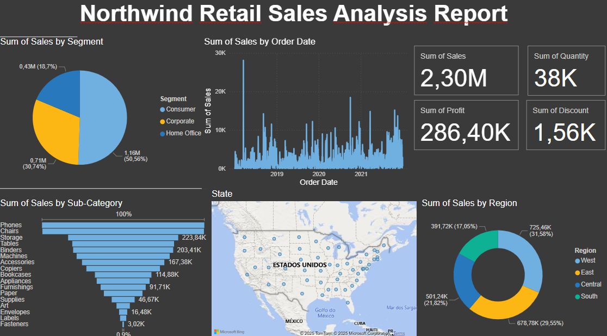

# Data Analytics Portfolio – Gabriela Lima

Welcome! I’m a junior data analyst with a background in project management and operations. My work focuses on transforming data into strategic insights using Python, SQL, R, Power BI, and Excel. This portfolio features selected analytics projects that demonstrate my skills in exploratory analysis, dashboarding, and business problem-solving.

---

## Projects Overview

### 1. Bellabeat Case Study (R, Kaggle)  
**Goal:** Analyze smart device user behavior to uncover activity and sleep trends for Bellabeat’s product strategy.  
**Tools:** R (`dplyr`, `ggplot2`), Kaggle  
**Key insights:**  
- Most users sleep between 6–7 hours  
- Clear relationship between steps and calories burned  
- Recommendation: Implement weekday activity reminders  
**Notebook:** [View on Kaggle](https://www.kaggle.com/code/gabriielaml/bellabeat-case-study-user-activity-insights)

---

### 2. Online Retail Analytics (Python, Kaggle)  
**Goal:** Understand customer behavior and return patterns in an e-commerce dataset.  
**Tools:** Python (`pandas`, `matplotlib`, `seaborn`)  
**Key insights:**  
- Seasonal peaks in purchases  
- High return rates in specific categories  
- UK dominates transactions — target opportunity  
**Notebook:** [View on Kaggle](https://www.kaggle.com/code/gabriielaml/online-retail-analytics)

---

### 3. Superstore Sales Analysis (SQL + Python, Kaggle)  
**Goal:** Investigate sales performance, shipping methods, and regional trends.  
**Tools:** SQL (`ipython-sql`), Python (`pandas`, `plotly`)  
**Key insights:**  
- West leads in sales but not profits  
- Standard Class shipping most used  
- Technology category is most profitable  
**Notebook:** [View on Kaggle](https://www.kaggle.com/code/gabriielaml/superstore-sql-sales-analysis-portfolio-project)

---

### 4. Hospital Discharge Analysis (SQL + Python, Kaggle)  
**Goal:** Explore discharge patterns and payer types across hospital facilities.  
**Tools:** SQL, Python (`pandas`)  
**Key insights:**  
- Payer mix differs widely by facility  
- Public patients have longer stays  
**Notebook:** [View on Kaggle](https://www.kaggle.com/code/gabriielaml/sql-data-analysis-patient-discharges-and-hospital)

---

### 5. Tesla Financial Analysis (Python, Kaggle)  
**Goal:** Perform financial analysis and valuation of Tesla using DCF modeling.  
**Tools:** Python (`pandas`, `matplotlib`, `NumPy`)  
**Key insights:**  
- Modeled 5-year intrinsic value: ~$57.2B  
- Conducted sensitivity analysis for growth/discount rate  
**Notebook:** [View on Kaggle](https://www.kaggle.com/code/gabriielaml/tesla-financial-analysis)

---

### 6. Northwind Retail Dashboard (Power BI & Excel)  
**Goal:** Create sales performance dashboard to monitor regions, products, and segments.  
**Tools:** Power BI, Excel  
**Key insights:**  
- East region had highest sales  
- Phones, storage, and chairs top-selling products  
- Consumer segment makes up over 50% of sales  
**Files:**  
- [PBIX file](./northwind_sales_report.pbix)  
- [Excel dataset](./Northwind_Retail_Excel.xlsx)  
**Dashboard preview:**  

---

### 7. Employee Insights Dashboard (Power BI & Excel)  
**Goal:** Analyze employee headcount, salaries, gender distribution, and departments.  
**Tools:** Power BI, Excel  
**Key insights:**  
- São Paulo is the main location  
- Marketing has the highest average salary  
- Gender distribution varies by department  
**Files:**  
- [PBIX file](./PowerBI_Funcionarios/funcionarios2.pbix)  
- [Excel dataset](./PowerBI_Funcionarios/Funcionarios_.xlsx)  
**Dashboard preview:**  

---

### 8. Brazil Education Dashboard (Power BI & CSV)  
**Goal:** Explore school types, demographics, and geographic distribution in Brazil.  
**Tools:** Power BI, CSV  
**Key insights:**  
- 54% private vs 46% public schools  
- Most students are around age 11, grade 6  
- Dropout rates are low; gender is balanced  
**Files:**  
- [PBIX file](./brazil_education_dashboard/Power%20BI%20dashboard.pbix)  
- [Cleaned dataset](./brazil_education_dashboard/brazil_education_dataset_cleaned.csv)  
**Dashboard preview:**  

---

## Technical Skills

- **Languages & Libraries:** Python (pandas, matplotlib), R (ggplot2, dplyr), SQL  
- **Tools:** Power BI, Excel, Jupyter, Git, Google Sheets  
- **Analysis:** Data cleaning, EDA, KPIs, dashboarding, business recommendations  
- **Other:** Project coordination, stakeholder communication, budgeting

---

## About Me

I recently transitioned into data analytics from a career in project coordination. I hold a certificate in data analytics from Google and intermediate Python certification. I have a strong interest in using data to solve real business problems, and I enjoy working with both numbers and people.

I'm actively looking for junior-level data analyst or business intelligence roles in the UK (remote or hybrid).

---

## Contact

Email: gabrielamerceslima@gmail.com  
GitHub: [github.com/gabrielamerces](https://github.com/gabrielmerces)

---
